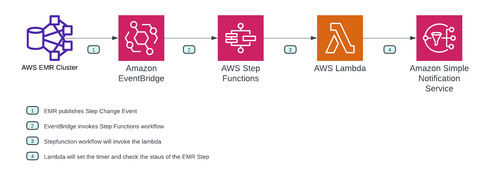

# Alert Notifications for Long Running EMR Jobs

Many Organizations run big data ETL Jobs on Amazon EMR using open source tool Apache Spark. 
Run time of the ETL Jobs may vary from few minutes to few hours, so it is very important to know the status of the job and get alert notifications if the job is running longer than expected or failed due to some error condition. As of now EMR does not generate any such alert notifications out of the box.

# Solution Overview

In this blog post we will show you how to create such alert notifications using event driven architecture in AWS. We will use the following AWS Services to build this solution.
 
1. EventBridge
2. Stepfunction
3. Lambda 
4. SNS

